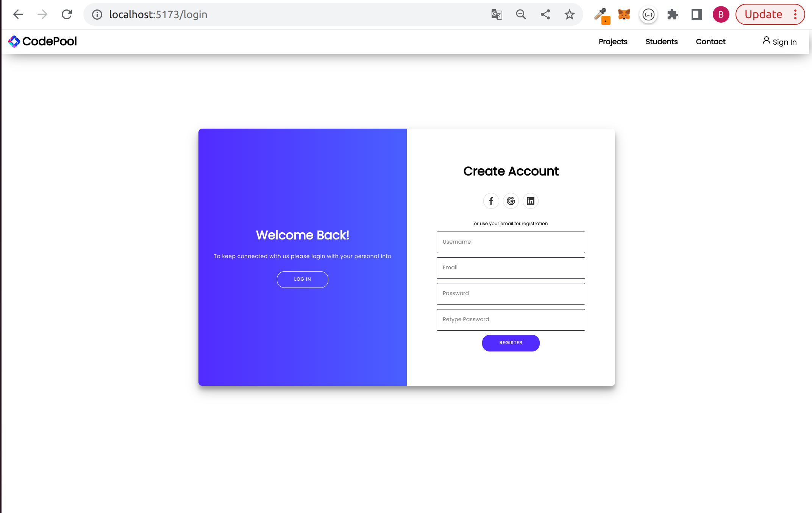
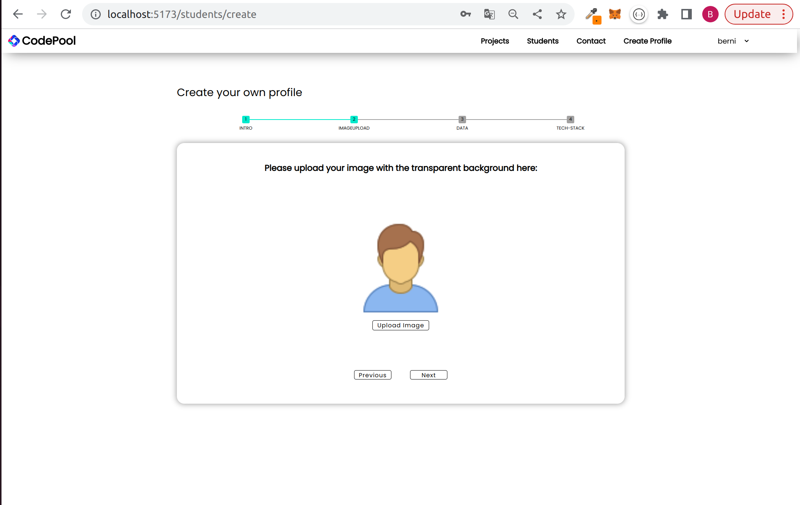
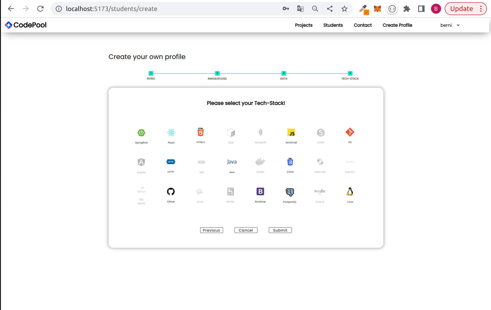
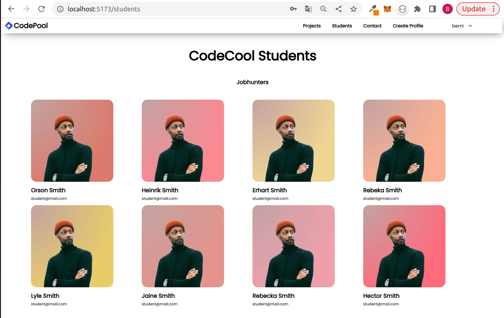

# CodePool
 A platform facilitating interaction between (CodeCool Austria companies) and their students.

## Features
Login, Logout, Register, creation of a student profile

## Built with
Spring Boot, Spring Security, Java, React, JavaScript, CSS

As a CodeCool student you can create an account and create a profile to showcase your 
skills and projects, which partner companies are looking for. 

Register as a CodeCool student

Create a profile and upload an image

Choose your Tech Stack

Check out all students their skills and projects


## Codesnippets

In the StudentService class the .save() method uses the StudentRepository to save a 
student with all the data in the database.
```js 
public Student save(Student student) {
        List<Technology> technologies = student.getTechnologies();
        List<Technology> allDistinctTechnologies = technologyRepository.findAll()
                .stream()
                .collect(Collectors.toMap(Technology::getImage, Function.identity(), (t1, t2) -> t1))
                .values()
                .stream().toList();
        List<Technology> persistedTechnologies = technologies.stream()
                .map(technology -> allDistinctTechnologies.stream().filter(tech -> tech.getId() == technology.getId()).findFirst().get())
                .collect(Collectors.toList());
        student.setTechnologies(persistedTechnologies);
        return studentRepository.save(student);
    }
```
Test to verify the save method

```js
  @ParameterizedTest
    @ValueSource(strings = {"POST", "PUT"})
    void saveAndUpdateStudent(String httpMethodName) throws Exception {
        List<Technology> technologies = List.of(new Technology("javaIcon"));
        Student student = new Student("testFirstName", "testLastName", "testAge", "testEmail", "testSelfDescription", "testProjectDescription", "testImage", technologies);
        String body = """
                {"firstName": "testFirstName",
                "lastName": "testLastName",
                "age": "testAge",
                "email": "testEmail",
                "selfDescription": "testSelfDescription",
                "projectDescription": "testProjectDescription",
                "image": "testImage",
                "technologies": ["javaIcon"]}
                """;

        mockMvc.perform(MockMvcRequestBuilders.request(HttpMethod.valueOf(httpMethodName), url)
                        .contentType(APPLICATION_JSON)
                        .content(body))
                .andExpect(status().isOk());

        verify(studentService).save(student);
    }
```

## Git commit messages rules

- Present Tense
- First letter is capitalized
- No punctuation
- Body not more than 72 characters
- Headline not more than 50 characters
- Use the imperative mood

Verbs:
Add, Create, Improve, Refactor, Bump (Increase the version of something e.g. dependency),Fix, Remove, Merge,

For BugFix:
BugFixBackend
bfb: commit message

BugFixFrontend
bff: commit message
